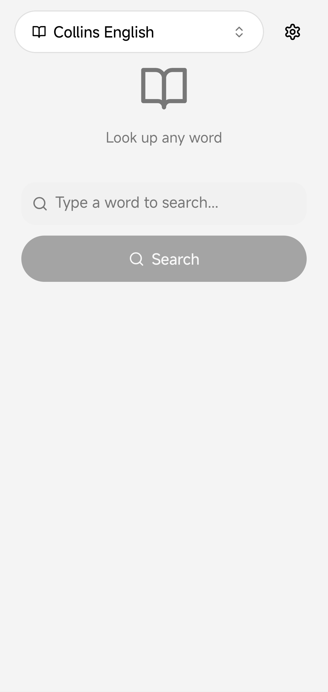
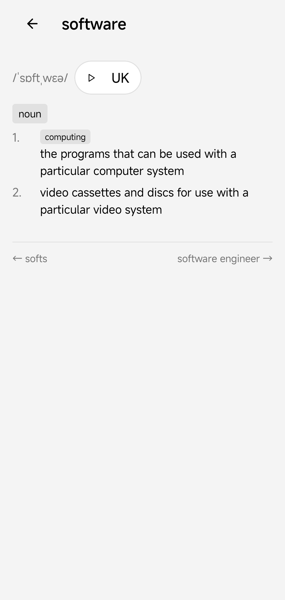
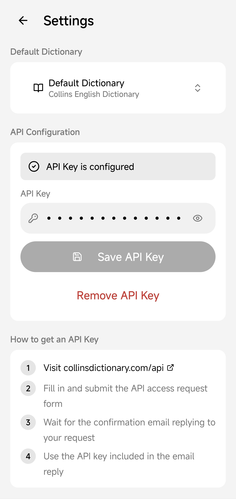

English | [简体中文](README.zh-CN.md)

<p align="center">
  
</p>

# Collins Dictionary

> www.collinsdictionary.com © HarperCollins Publishers Ltd 2025
>
> The above attribution is required by the [Collins API Terms and Conditions](https://blog.collinsdictionary.com/terms-conditions-collins-api/).
> This application is not promoted, endorsed, or sponsored by HarperCollins Publishers.

[](https://github.com/Black-Cyan/collins-dictionary/actions/workflows/release.yml)
[](https://github.com/Black-Cyan/collins-dictionary/releases/latest)
[](https://www.gnu.org/licenses/gpl-3.0)

A cross-platform desktop and Android dictionary application powered by the
Collins Dictionary API. Built with Kotlin Multiplatform and Compose
Multiplatform, it provides a native experience on Linux and
Android from a single shared codebase.

## Screenshots

<table>
  <tr>
    <td></td>
    <td></td>
    <td></td>
  </tr>
</table>

## Features

- Full-text dictionary lookups with detailed entry information
- Pronunciation audio playback 
- Example sentences and usage notes
- Bookmarks for offline access to previously viewed entries
- Automatic dark mode following the system theme
- Cross-platform: Linux (.deb, .rpm, .tar.gz) and Android

## Getting a Collins API Key

The application requires a Collins Dictionary API key to function. To obtain
one:

1. Visit <https://www.collinsdictionary.com/api>, scroll to the bottom and click **fill in this form** (or equivalent link on the page).
2. Fill in and submit the API access request form.
3. Wait for a confirmation email from Collins acknowledging your request.
4. Reply to that email to receive your API key.

Once you have the key, open the application and enter it in **Settings > API
Configuration**, or set the environment variable `COLLINS_ACCESS_KEY` before
launching.

## Downloads

Pre-built packages for each release are available on the
[Releases](https://github.com/Black-Cyan/collins-dictionary/releases/latest)
page.

| Platform | Format          | Notes                             |
|----------|-----------------|-----------------------------------|
| Linux    | `.deb` (x64)    | Debian, Ubuntu, and derivatives   |
| Linux    | `.rpm` (x64)    | Fedora, RHEL, and derivatives     |
| Linux    | `.tar.gz` (x64) | Extract and run; a JRE is bundled |
| Android  | `.apk`          | Android 8.0+ (API 26)             |

### Arch Linux
An AUR package `collins-dictionary-bin` is maintained in the `packaging/aur/`
directory of this repository. AUR registration is currently closed; the
package can be built locally from the PKGBUILD. See
[`packaging/aur/README.md`](packaging/aur/README.md) for instructions.

## Building from Source

### Prerequisites

- JDK 21+ (the build uses [JetBrains Runtime](https://www.jetbrains.com/jbrs/)
  with automatic toolchain provisioning; no manual JBR install is required)

### Desktop

```bash
./gradlew :desktopApp:run
```

To create a distributable package (includes a bundled JRE):

```bash
./gradlew :desktopApp:createDistributable
```

The output is written to `desktopApp/build/compose/binaries/main/app/`.

### Android

Set the signing environment variables before building a release APK:

```bash
export KEYSTORE_BASE64=<base64-encoded-keystore>
export KEY_ALIAS=<alias>
export KEY_PASSWORD=<password>
export KEYSTORE_PASSWORD=<store-password>
```

Then build:

```bash
./gradlew :androidApp:assembleRelease
```

For a debug build (no signing required):

```bash
./gradlew :androidApp:assembleDebug
```

## Tech Stack

| Layer            | Technology                 |
|------------------|----------------------------|
| Language         | Kotlin (Multiplatform)     |
| UI               | Compose Multiplatform 1.11 |
| Networking       | Ktor (OkHttp engine)       |
| Serialization    | kotlinx.serialization      |
| Audio (JVM)      | JLayer                     |
| Image loading    | Coil 3                     |
| Settings storage | multiplatform-settings     |
| Build system     | Gradle 9.1 with Kotlin DSL |
| CI               | GitHub Actions             |

## Contributing

Contributions are welcome. Please open an issue to discuss a proposed change
before submitting a pull request.

1. Fork the repository.
2. Create a feature branch (`git checkout -b my-feature`).
3. Commit your changes.
4. Push to the branch (`git push origin my-feature`).
5. Open a pull request.

## Contributors

[](https://github.com/Black-Cyan/collins-dictionary/graphs/contributors)

See the full list of [contributors](https://github.com/Black-Cyan/collins-dictionary/graphs/contributors).

## License

This project is licensed under the
[GNU General Public License v3.0](https://www.gnu.org/licenses/gpl-3.0.html).

See [LICENSE](LICENSE) for the full text.
